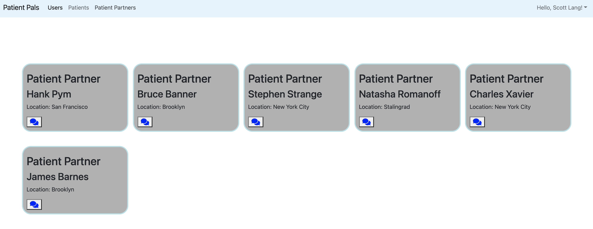
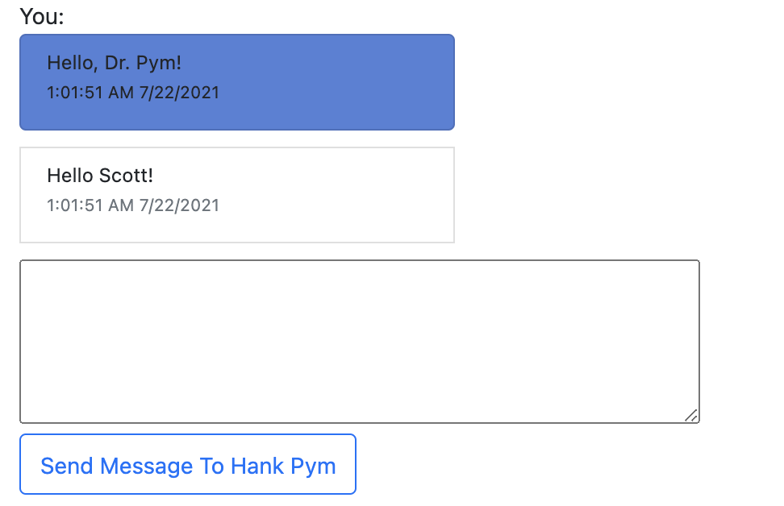

# Patient-Pals

This is a simple chat application using React, Redux, and Bootstrap Frontend with a Ruby on Rails Backend.


---

## View this project hosted on <a href="https://patient-pals.herokuapp.com/#/" target="_blank">Heroku</a>.

---

# Technologies Used

| Backend                                                    | Frontend                                                                      |
| ---------------------------------------------------------- | ----------------------------------------------------------------------------- |
| [Ruby on Rails](https://rubyonrails.org/)                  | [React](https://reactjs.org/)                                                 |
| [PostgreSQL](https://www.postgresql.org/)                  | [Redux](https://redux.js.org/)                                                |
| [jbuilder](https://github.com/rails/jbuilder)              | [Bootstrap](https://www.bootstrapcdn.com/)                                    |
| [bcrypt](https://rubygems.org/gems/bcrypt/versions/3.1.12) | [FontAwesome](https://fontawesome.com/how-to-use/on-the-web/using-with/react) |

## Future Ideas

- Add Photos for Users
- Web Sockets for realtime chat

### Table Types

- **User Model**

  - First Name
  - Last Name
  - Age
  - Location
  - Email
  - Password
  - Role (Patient, Patient Partner)

- **Conversation Model**

  - Sender ID
  - Recipient ID
  - Sender Name
  - Recipient Name

- **Messages Model**

  - Body
  - Conversation ID
  - User ID

### Features

1. Patient and Patient Partner Index

Only Patients can message Patient Partners and vice versa.



```jsx
{
  currentUser.role !== user.role ? (
    <button onClick={this.handleSubmit}>
      <Link to={`/conversations/${user.id}/messages`}>
        {' '}
        <FontAwesomeIcon icon={faComments} color="blue" size="lg" fixedWidth />
      </Link>
    </button>
  ) : (
    ''
  )
}
```

2. Chat

Utilizing componentDidUpdate(), I rendered chat messages as it persists in the database.

```js
  componentDidUpdate(prevProps) {
    const { messages, fetchMessages } = this.props
    let didUpdate =
      Object.keys(messages).length !== Object.keys(prevProps.messages).length
    if (
      didUpdate &&
      Object.keys(messages).length &&
      Object.keys(prevProps.messages).length
    ) {
      fetchMessages(this.props.conversationId)
    }
  }
```



---

## Resources

- [Rspec Gem](https://github.com/rspec/rspec-rails)
- [Build Your Chat Application on React & Rails — Part I | by Gunjan Solanki | Medium](https://gunjansolanki-007.medium.com/build-your-chat-application-on-react-rails-part-i-13ef1a5ad21c)
